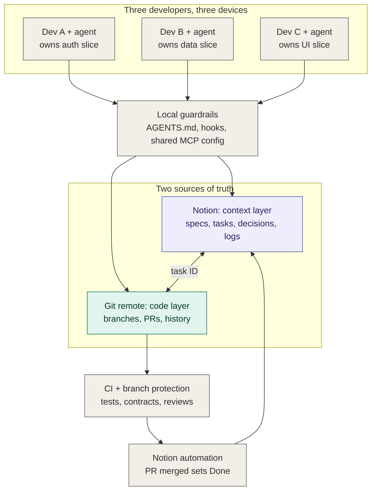
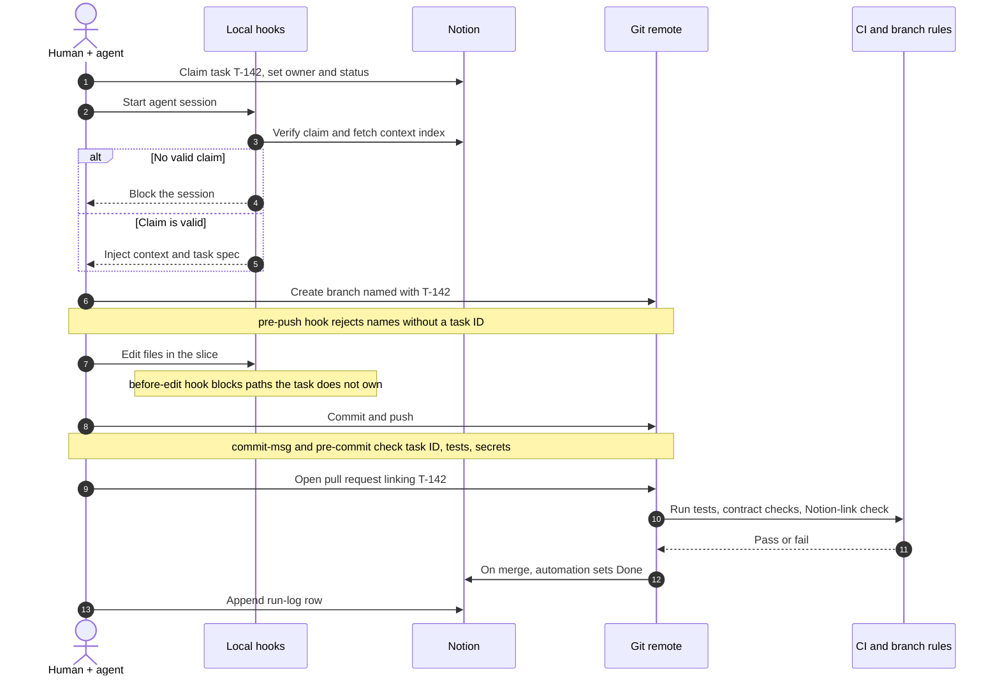
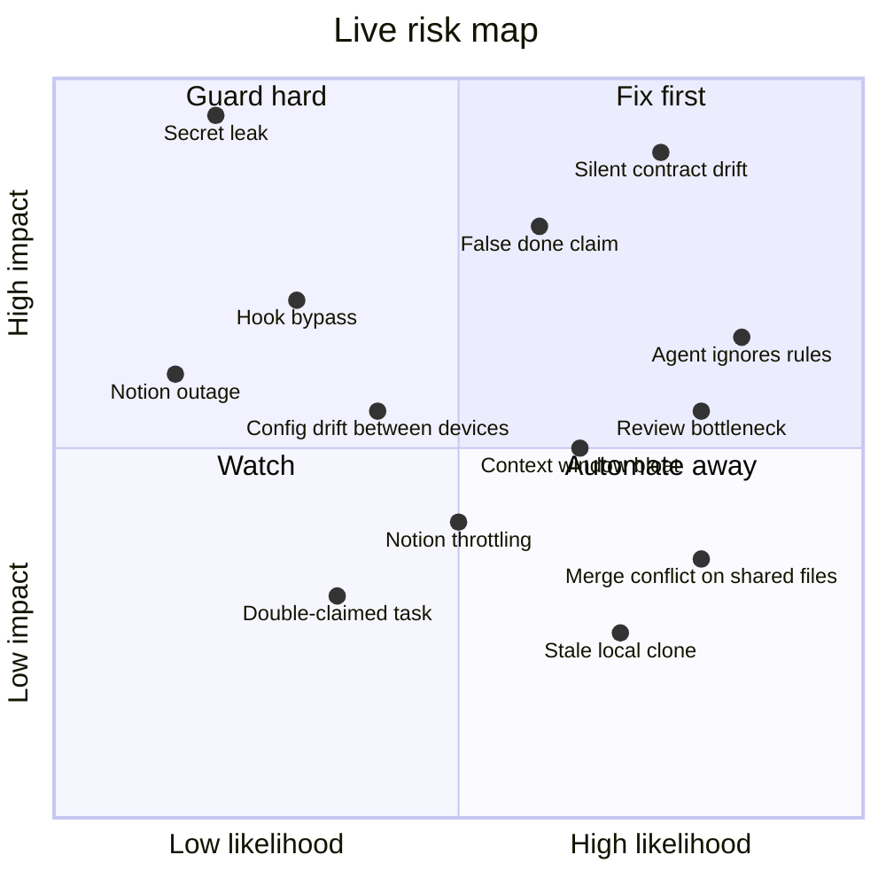
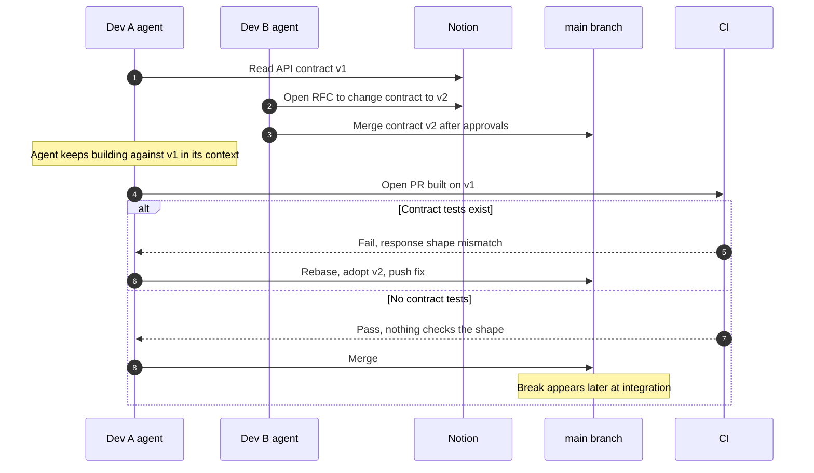
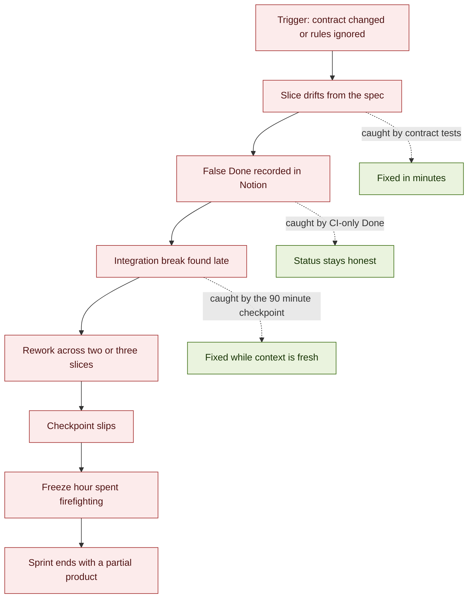
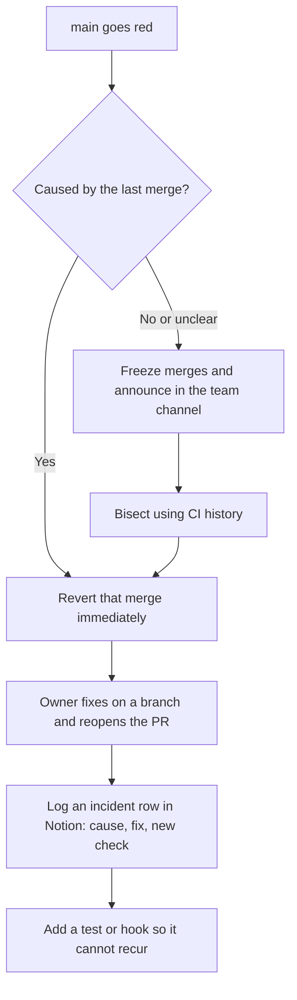

# Workflow: three people, Notion, Git and AI agents in one sprint

A working model for a three-person team where every person has their own device and their own AI agents, all connected through MCP to the same Notion workspace and the same Git repository, with enforcement that does not depend on anyone remembering the rules.

## Contents

1. [Core principle](#1-core-principle)
2. [Architecture](#2-architecture)
3. [How compliance is forced](#3-how-compliance-is-forced)
4. [Shared repo configuration](#4-shared-repo-configuration)
5. [What lives in Notion](#5-what-lives-in-notion)
6. [Life of one task, with gates](#6-life-of-one-task-with-gates)
7. [Keeping three slices cohesive](#7-keeping-three-slices-cohesive)
8. [Design-time failure modes](#8-design-time-failure-modes)
9. [Real-time risks, fallacies and fallouts](#9-real-time-risks-fallacies-and-fallouts)
10. [Sprint rhythm](#10-sprint-rhythm)
11. [Setup order](#11-setup-order)

---

## 1. Core principle

Each tool has one job.

| Tool | Holds | Answers the question |
|---|---|---|
| Notion | Intent: specs, tasks, owners, decisions, run logs | What are we building, why, and who owns it? |
| Git | Reality: the code and its history | What does the system actually do right now? |
| Task ID | The key that joins the two | Which intent does this change belong to? |

You cannot force an AI agent to follow rules by writing them in a prompt. A prompt is advisory. Real enforcement comes from things that run outside the agent's judgment: hooks, git hooks, CI and branch protection. The design stacks several layers so each catches what the previous one missed.

---

## 2. Architecture



Purple is context, teal is code, gray is people and guardrails.

---

## 3. How compliance is forced

| Layer | Runs where | Can the agent skip it? |
|---|---|---|
| `AGENTS.md` / `CLAUDE.md` | Inside the agent's context | Yes. It is only a strong suggestion |
| Agent hooks (session start, before-edit, on-stop) | Your device | Not without editing config, and the config lives in the repo |
| Git hooks (`pre-commit`, `commit-msg`, `pre-push`) | Your device | Only with `--no-verify` |
| CI + branch protection | GitHub's servers | No. Nobody can push to `main` without passing |

The last row is the real enforcement. Everything above it makes failures cheap and early, so you do not discover them at PR time.

Agent hooks exist in some tools (Claude Code has session-start, before-tool-use, after-tool-use and stop events, for example). Other tools have equivalents or none, which is why git hooks and CI are the tool-agnostic layer.

---

## 4. Shared repo configuration

Commit the wiring into the repo so all three devices behave identically. A new teammate who clones gets the whole setup.

| Path | Purpose |
|---|---|
| `.mcp.json` (or your tool's project-level MCP config) | Same Notion and Git tools on every device |
| `AGENTS.md` / `CLAUDE.md` | The rules the agent reads at session start |
| `.claude/hooks/` (or tool equivalent) | Session-start context load, before-edit ownership check |
| `.githooks/` + `git config core.hooksPath .githooks` | `commit-msg`, `pre-commit`, `pre-push` checks |
| `CODEOWNERS` | Maps each module to a person, drives review rules and the ownership hook |
| `/contracts` | Shared API shapes and types, changed only through an RFC |
| `/context-snapshot` | Read-only cached copy of the Notion context index, refreshed at session start |
| `.github/workflows/ci.yml` | Tests, contract checks, Notion-link check |
| `.github/pull_request_template.md` | Task link, "Notion updated?" checkbox |

A minimal `AGENTS.md`:

```
Before any work:
1. Read the Notion page "Context index", then the spec linked from your task.
2. Your task ID is in $TASK_ID. If it is missing, stop and ask the human.

Rules:
- Edit only paths owned by your task's module (see CODEOWNERS).
- Never edit /contracts. Propose changes as an RFC row in Notion.
- Every commit starts with the task ID: "T-142: add login form".

After work:
- Append a run-log row in Notion: what changed, what is unfinished, decisions made.
- Open a PR that links the Notion task.
```

---

## 5. What lives in Notion

| Item | Type | Purpose | Written by | Notes |
|---|---|---|---|---|
| Context index | Page | Short entry point that links to everything | Humans | Always loaded by agents. Keep it small so it never bloats the context window |
| Specs and architecture | Pages | Deep detail | Humans | Loaded on demand, only when the task needs them |
| Tasks | Database | ID, owner, module, status, spec link, PR link | Humans, automation | The join key to Git. Only automation sets Done |
| Decisions log | Database | One row per decision and its reasoning | Humans, agents | Stops agents re-litigating settled choices |
| Contracts and RFCs | Database | Proposed and approved interface changes | Humans | One row per change, approvals recorded |
| Agent run logs | Database | What each agent changed, left unfinished, decided | Agents | Append-only. Each agent adds its own row and never edits a shared page |

---

## 6. Life of one task, with gates



| Step | What the agent does | Gate | Enforced by |
|---|---|---|---|
| 1 | Claim task, set owner and status | Task must be claimed | Session hook needs a task ID |
| 2 | Branch from `main`, name includes the task ID | Branch name check | `pre-push` hook, then CI |
| 3 | Load context: index, then task spec | Context injected | Session hook pulls the pages |
| 4 | Build inside owned paths only | Path ownership | Before-edit hook, then `CODEOWNERS` review |
| 5 | Commit and push, task ID in each commit | Commit checks | `commit-msg`, `pre-commit`, then CI |
| 6 | Open PR, link the Notion task | CI and review | Tests, contract checks, owner approval |
| 7 | Merge and log | Protected `main` | Only green PRs merge, automation sets Done |

---

## 7. Keeping three slices cohesive

Separate work only fits together if the seams are agreed upfront.

| Mechanism | What it does |
|---|---|
| Contracts first | Shared interfaces (API schema, shared types, DB schema) are written into `/contracts` before anyone codes. Only one person, or an RFC with all three approving, can change them |
| Ownership by path | `CODEOWNERS` maps modules to people. A PR touching someone else's code requires their review, and the before-edit hook uses the same map |
| Trunk-based, short branches | Branches live hours, not days. Long branches are where integration pain grows |
| End-to-end smoke test in CI | One test (sign up, create a record, see it in the UI) runs on every PR. It is the cheapest proof the slices still fit |
| Scheduled integration checkpoints | Everyone merges and the smoke test runs on a fixed cadence (see section 10) |

---

## 8. Design-time failure modes

These are the failures you can predict and design against before the sprint starts.

| Failure | What happens | Defence |
|---|---|---|
| Agent ignores the rules | Prompts are skippable, so it edits outside its slice or skips Notion | Hooks plus CI. Trust server-side checks, not the prompt |
| Context drift | Notion says one thing, code does another | PR template asks "Notion updated?", merge automation writes status, a drift-check agent runs before the freeze |
| Double-claimed task | Notion has no true locking, so two people can claim a row within seconds | Humans pre-assign owners at kickoff. CI allows one open PR per task ID |
| Contract changed silently | One slice's change breaks the other two | `/contracts` has one owner. Changes go through RFC plus contract tests in CI |
| Merge conflicts on shared files | Lockfiles, route indexes and schemas are touched by everyone | Rebase at every session start (hook). Keep shared files tiny with one owner |
| Notion API limits or outage | Notion throttles at roughly a few requests per second per integration, and an agent can stall mid-task | Cache the context index in the repo as a read-only snapshot. Batch writes into the end-of-task log |
| Context window bloat | Agent loads too many pages and gets worse | Context pyramid: small index always loaded, deep pages on demand |
| Agent claims "done" falsely | It says the feature works, but it does not | Only CI-green merges flip a task to Done. Agents cannot set that status |
| Secrets leak | An API key lands in a commit or a Notion page | Secret scan in `pre-commit` and CI. Scope the Notion integration to the project workspace only |
| Stale local clone | Someone works from yesterday's `main` | Session hook runs `git fetch` and rebases first |

---

## 9. Real-time risks, fallacies and fallouts

Section 8 covers what you can predict. This section covers what goes wrong while the sprint is running: failures that appear live, the false assumptions that let them through, and how one small failure cascades into a large one.

### 9.1 Live risk map



Placement is a starting estimate. Re-score after your first checkpoint using what actually happened.

### 9.2 Live risk register

| ID | Risk | How it shows up live | Blast radius | First response |
|---|---|---|---|---|
| R1 | Silent contract drift | An agent builds against contract v1 after v2 merged. PR passes because nothing checks the shape | Two or three slices break at integration | Contract tests in CI. Announce every contract merge in the team channel and in Notion |
| R2 | Agent ignores rules | Edits outside its slice, skips the Notion log, invents a task ID | One slice, plus untracked work | Before-edit hook blocks it. CI rejects PRs without a valid task link |
| R3 | False "done" claim | Agent reports success, tests were not run or do not cover the feature | Notion shows Done while the feature is broken | Only automation sets Done on a green merge. Humans spot-check one task per checkpoint |
| R4 | Review bottleneck | Three agents open PRs faster than three humans can review them | `main` goes stale, branches get long, conflicts rise | Cap open PRs per person. Keep PRs small. Review before starting new work |
| R5 | Context window bloat | Agent output gets vaguer or contradicts earlier decisions | Quality drops without any error message | Reload from the index, not the full wiki. Start a fresh session per task |
| R6 | Merge conflict on shared files | Rebase fails on lockfiles, route indexes, schemas | One person blocked for a while | One owner per shared file. Rebase at every session start |
| R7 | Stale local clone | Work starts from an old `main` | Wasted work, surprise conflicts | Session hook runs `git fetch` and rebases first |
| R8 | Config drift between devices | One device has an old hook version or different MCP setup | Same rule passes on one laptop and fails on another | Hooks and MCP config live in the repo. CI repeats every local check |
| R9 | Notion throttling | Agent calls return 429 or stall mid-task | One agent paused, possibly with half-written logs | Read from the repo snapshot. Batch writes at end of task. Retry with backoff |
| R10 | Double-claimed task | Two people or agents start the same work | Duplicate effort, conflicting PRs | Pre-assign owners. CI allows one open PR per task ID |
| R11 | Hook bypass | A commit made with `--no-verify` reaches the remote | Local checks skipped for that commit | CI repeats every check, so the bypass is caught at PR time |
| R12 | Secret leak | Key committed to Git or pasted into a Notion page | Credential exposure, rotation required | Secret scan in `pre-commit` and CI. Rotate the key at once, rewriting history is not enough |
| R13 | Notion outage | Context cannot be fetched or written | All agents lose live context | Work from `/context-snapshot`. Queue log entries and write them after recovery |

### 9.3 Race condition: stale contract

This is the most dangerous real-time failure because it looks like success until integration.



The difference between the two branches is one automated test. That is why contract tests are the highest-value check in the whole setup.

### 9.4 Fallout cascade

One small failure becomes a sprint-level failure when nothing interrupts the chain. The dotted links show where a gate stops it.



### 9.5 Fallacies that let failures through

These are the false beliefs teams hold while the sprint is running. Each one removes a gate from the picture.

| Fallacy | Why it feels true | Reality | Correction |
|---|---|---|---|
| "The agent read `AGENTS.md`, so it will follow it" | It usually does | Instructions are weighed against the task and can be dropped, especially late in a long session | Enforce with hooks and CI. Treat the file as guidance |
| "Notion is the single source of truth for everything" | Everything is documented there | Notion is truth for intent. Git is truth for behavior. When they disagree, running code wins and Notion must be corrected | Name which is authoritative for what, and run a drift check |
| "Separate slices mean no conflicts" | Nobody edits the same module | Slices share contracts, lockfiles, config and the database schema | Ownership for shared files, rebase often, contract tests |
| "Green CI means the product works" | The check mark is reassuring | CI only checks what someone wrote a test for | Keep one end-to-end smoke test and add a test for every integration bug |
| "More agents means more speed" | Output volume rises | Review and integration become the bottleneck, and each extra stream raises conflict risk | Limit open PRs per person. Optimize merge flow, not generation |
| "We will update the docs at the end" | Coding feels more urgent | End-of-sprint docs are reconstructed from memory and are wrong | Notion update is part of Done, and the log is written per task |
| "Hooks are a security boundary" | They block things on your laptop | Local hooks can be skipped or misconfigured | Only server-side checks are a boundary. Repeat every hook in CI |
| "Notion state is live and atomic" | The UI updates instantly | There is no locking, reads can be stale and concurrent writes can overwrite each other | Append-only logs, pre-assigned owners, a repo snapshot for reads |
| "Every device has the same context" | Same repo, same MCP config | Each session has its own context window, and long sessions lose early detail | Reload the index at session start and after any context reset |
| "If it merged, it is integrated" | The merge button turned green | A merge only means the PR passed its checks, not that slices work together | Integration checkpoint with the smoke test on `main` |
| "The agent's self-report is reliable" | It sounds confident | Agents can overstate success | Verify with CI output, never with the agent's own summary |

### 9.6 Live signals to watch

Set these up as a Notion view, a scheduled GitHub Action, or a team-channel bot, so problems surface without anyone hunting for them.

| Signal | Where to watch | Threshold | Action |
|---|---|---|---|
| `main` is red | CI status | More than 10 minutes | Stop merges, run the incident flow in 9.7 |
| Task In progress with no commits | Notion vs Git | 2 hours | Check in. The agent may be stuck or the task mis-scoped |
| PR open and unreviewed | GitHub | 45 minutes | Review before starting anything new |
| Branch behind `main` | Git | More than 15 commits | Rebase now and re-run tests |
| Merged PR with no run-log row | Notion vs Git | Any | Agent or human writes the log before the next task |
| Change under `/contracts` | Git | Any | Post to the team channel. Others rebase before continuing |
| Notion API errors (429 or 5xx) | Agent output, CI logs | 3 in a row | Switch to the repo snapshot and queue writes |
| Hook-blocked actions | Hook logs | Same block repeated 3 times | The agent is stuck against a rule. A human intervenes |
| Commits per hour from one agent | Git | Unusually high | Possible runaway loop. Pause the session |
| Task marked Done by a person | Notion history | Any | Revert. Done must come from automation |

### 9.7 When it breaks: incident flow



Revert first and diagnose second. A red `main` blocks all three people, so restoring green is worth more than understanding the cause immediately.

| Scenario | Contain in the first 5 minutes | Recover | Prevent next time |
|---|---|---|---|
| `main` is red | Freeze merges, revert the last merge | Fix on a branch, reopen PR | Add the missing test |
| Contract broke two slices | Revert the contract merge or announce a hotfix | Both owners rebase onto the fixed contract | Contract tests, RFC approval from all affected owners |
| Agent edited out-of-slice files and merged | Revert the PR | Re-do the change inside the owner's slice | Tighten the before-edit hook and `CODEOWNERS` |
| Secret committed | Rotate the key first | Remove from history, force-push per team policy | Secret scan in `pre-commit` and CI |
| Notion unavailable | Switch agents to `/context-snapshot` | Replay queued log entries when it returns | Keep the snapshot fresh at every session start |
| Two people built the same task | Pick one PR, close the other | Salvage useful parts from the closed branch | Pre-assign owners, one open PR per task ID |
| Agent in a runaway loop | Kill the session | Squash or revert noisy commits | Per-session commit and tool-call limits |
| Agent lost context mid-task | Start a fresh session on the same task ID | Agent reloads index, spec and its own last run-log row | Write a run-log checkpoint before long steps |

---

## 10. Sprint rhythm

```mermaid
gantt
    title Example 8-hour sprint
    dateFormat HH:mm
    axisFormat %H:%M
    section Team
    Kickoff and contracts       :k, 09:00, 60m
    Work block 1                :w1, 10:00, 90m
    Integration checkpoint 1    :crit, c1, 11:30, 30m
    Work block 2                :w2, 12:00, 90m
    Integration checkpoint 2    :crit, c2, 13:30, 30m
    Work block 3                :w3, 14:00, 90m
    Integration checkpoint 3    :crit, c3, 15:30, 30m
    Freeze and drift check      :crit, f, 16:00, 60m
    Ship and retro              :s, 17:00, 30m
```



Adjust the block lengths to your sprint. Keep the checkpoint cadence at roughly every 90 minutes.

| Phase | Who | What happens |
|---|---|---|
| Kickoff | All three humans | Write the context index, freeze contract v0, split tasks into slices, pre-assign owners, confirm every device has the same MCP config and hooks installed |
| Work block | Each person and their agents | Claim, branch, build, PR, merge inside their own slice |
| Integration checkpoint | All three | Everyone merges, the smoke test runs on `main`, breakage is fixed before new work starts |
| Contract change (any time) | Contract owner plus affected owners | RFC row in Notion, approval, contract merged first, everyone else rebases |
| Freeze (last hour) | All three | No new features. Integration fixes only, plus a drift check of Notion against code |
| Ship | All three | Tag the release, confirm every task is Done in Notion, log what was left over |

Checkpoint checklist:

| Check | Pass condition |
|---|---|
| `main` is green | CI passes on the latest commit |
| Open PRs are rebased | None behind `main` by more than a few commits |
| Contracts | Unchanged, or every change announced and rebased onto |
| Notion matches Git | Every merged PR has a Done task and a run-log row |
| Smoke test | End-to-end test passes on `main` |
| Review queue | No PR waiting longer than 45 minutes |

---

## 11. Setup order

CI with branch protection gives most of the guarantee on its own. The other layers make agents work smoothly with it instead of hitting it at PR time.

| Order | Build | Why this position |
|---|---|---|
| 1 | Shared repo config: `AGENTS.md`, project MCP config, `CODEOWNERS`, `/contracts` | Everything else reads from these |
| 2 | CI with branch protection, contract tests and the smoke test | The only layer nobody can skip |
| 3 | Git hooks via `core.hooksPath` | Catches problems before they reach CI |
| 4 | Agent hooks: session-start context load, before-edit ownership check | Stops problems before they are written |
| 5 | Notion databases and automation (task status on merge, run-log) | Closes the loop between Git and Notion |
| 6 | Live signals from section 9.6 | Surfaces problems while the sprint is still running |
